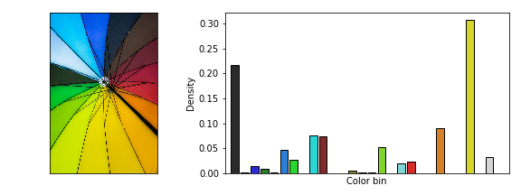
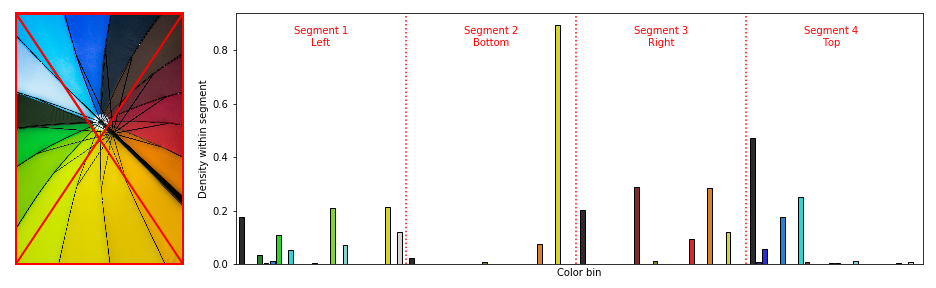
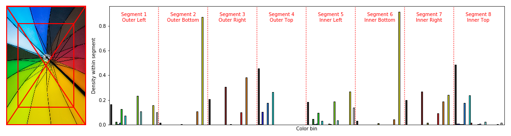

## radialColorHistogram

Color histograms provide a representation of colors, but no indication of image composition. `radialColorHistogram` allows the user to radially segment an image before extracting color histograms, thus retaining some representation of composition.

In the field of computer vision it is often impractical to use raw images as input to train a model. Instead it is necessary to use a lower dimensional representation, for instance many CNN architectures will downsize images to 224x224.

Under certain circumstances this may still be more information than is necessary. However a straight forward color histogram of the image may provide too little information. Hence `radialColorHistogram` provides a middle ground in image represenation.

The feature space from using `radialColorHistogram` will always be several times larger than using a simple color histogram, however this difference is relatively small when compared to the feature space of using raw or even downsized images.

| Representation      | Feature space     | 
| :------------- | :----------: | 
| Raw image: 2751x1834 pixels | 15,136,002   | 
| Downsized image: 224x224 pixels | 150,528 |
| Color histogram: 4 bins (per channel) | 64 |
| radialColorHistogram: 4 bins, 4 segments | 256 |
| radialColorHistogram: 4 bins, 16 segments | 1,024 |
| Color histogram: 8 bins (per channel) | 512 |
| radialColorHistogram: 8 bins, 4 segments | 2,048 |
| radialColorHistogram: 8 bins, 16 segments | 8,192 |

## Demonstration

`demo.ipynb` shows simple examples of radial color histograms and how to carry out batch processing for model inputs.

`color_density.py` contains the class ColorDensity, which is used to process images into color histograms. You can pass a list of images filepaths and it will process them all and return the featureset that can be used to train a model.

`radial_split.py` contains the class RadialSplitter, which is used to split an image into segments. This can be passed to ColorDensity to perform splitting on every image being processed.

`plotting_functions.py` contains functions for creating these plots:

##### Color histogram of entire image

##### Color histograms from four segments

##### Color histograms from eight segments

## License
`radialColorHistogram` is distributed under the BSD License

## Author
`radialColorHistogram` was developed by [Gareth Morinan](https://www.linkedin.com/in/gmorinan/)